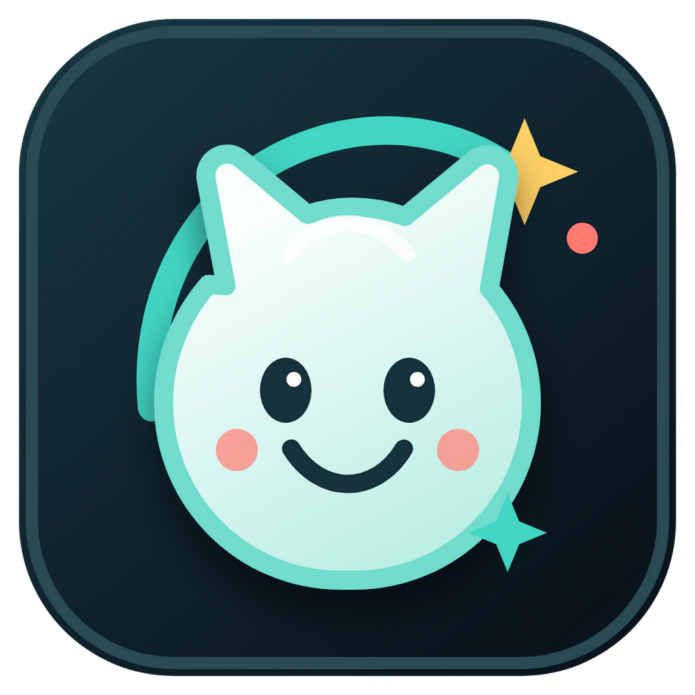

# LumiPet

<p align="center">
  
</p>

一个通用的 Live2D 桌面宠物，支持 Apple Silicon Mac 和 64 位 Windows。LumiPet 不附带任何角色模型，用户可以在首次启动时选择自己的模型文件夹，并在运行中切换模型。

角色与渲染资源从本地读取，运行时不会访问网络，也不需要屏幕录制或辅助功能权限。

## 下载与安装

- Apple Silicon Mac：从 [Releases](https://github.com/slipperpeng/LumiPet/releases) 下载 `LumiPet-<版本>-arm64.dmg`，打开后将 `LumiPet.app` 拖入“应用程序”。
- 64 位 Windows：从 [Releases](https://github.com/slipperpeng/LumiPet/releases) 下载 `LumiPet-<版本>-x64.exe` 并运行安装。

发布包目前未签名。macOS 首次阻止打开时，请在 Finder 中右键应用并选择“打开”；Windows Defender SmartScreen 可能显示未知发布者提示。

## 使用方式

- 首次启动：在系统对话框中选择包含 Live2D 模型的文件夹。
- 拖动角色：按住角色并移动鼠标，窗口尺寸保持不变。
- 切换模型：右键角色，在“模型”菜单中选择模型，或选择另一个模型文件夹。
- 重新扫描：模型文件夹内容变化后，可从“模型”菜单重新扫描。
- 打开菜单：右键角色，可调整显示比例、眼睛跟随和开机启动。
- 回到右下角：在右键菜单选择“回到右下角”。
- 退出：在右键菜单选择“退出 LumiPet”，或窗口获得焦点时按 macOS 的 `Command+Q` / Windows 的 `Ctrl+Q`。

取消首次选择后，LumiPet 仍会启动；此时右键角色并选择“模型 -> 选择模型文件夹...”即可继续设置。

## 模型目录

选择的目录可以直接包含模型，也可以包含多个模型子目录。例如：

```text
models/
  character-a/
    character-a.model3.json
    character-a.moc3
    character-a.physics3.json
    textures/
      texture_00.png
  character-b/
    character-b.model3.json
    ...
```

LumiPet 会递归扫描 `.model3.json` 文件，并检查模型清单引用的资源是否存在且位于所选目录内。支持 Cubism 3/4 常见的 `Moc`、`Textures`、`Physics`、`DisplayInfo`、动作和表情资源。仓库的 `model/` 目录只保留说明文件，不包含个人模型。

## 从源码运行

需要 Node.js 18 或更高版本。

```bash
npm install
npm start
```

源码运行不会注册开机启动，避免把开发环境中的 Electron 注册为登录项。

## 构建 macOS 应用与 DMG

```bash
npm run pack:mac
npm run dist:mac
```

构建结果位于：

```text
dist/mac-arm64/LumiPet.app
dist/LumiPet-<版本>-arm64.dmg
```

这是供个人使用的未签名应用。可以将 `.app` 移入 `/Applications`，也可以通过 DMG 安装。

## 构建 Windows 安装包

```bash
npm run dist:win
```

构建结果位于 `dist/LumiPet-<版本>-x64.exe`。这是未签名的 64 位 Windows 安装包；首次运行时 Windows Defender SmartScreen 可能显示未知发布者提示。

## 运行库

PixiJS、Live2D Cubism Core 和 pixi-live2d-display 的浏览器构建位于 `libs/`。第三方许可证与声明见 `THIRD-PARTY-NOTICES`。
